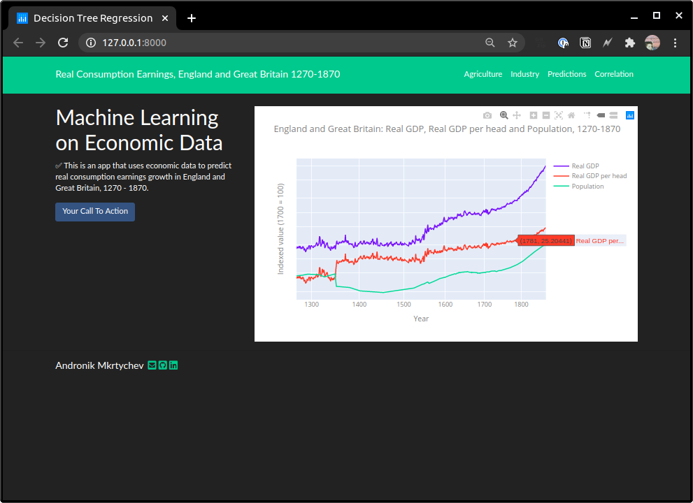
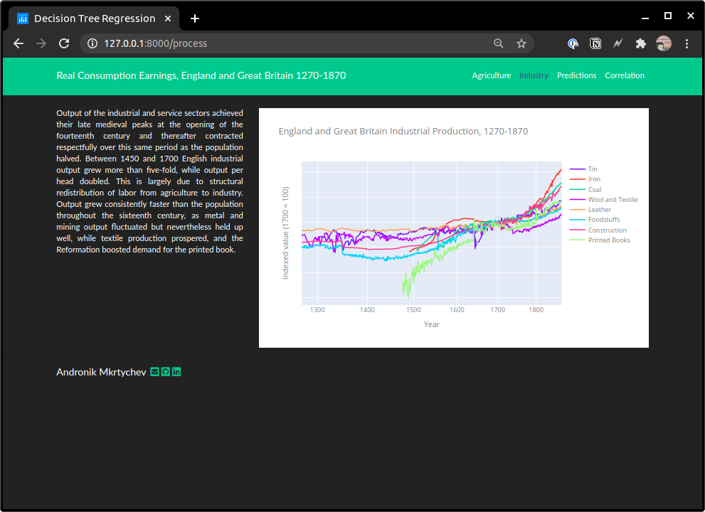
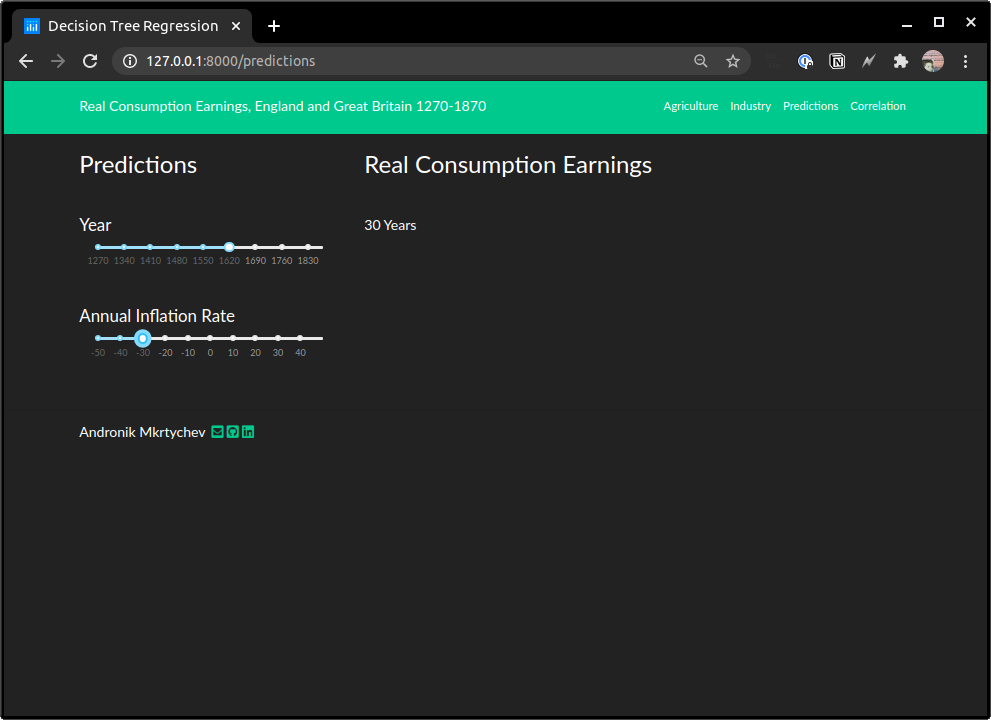
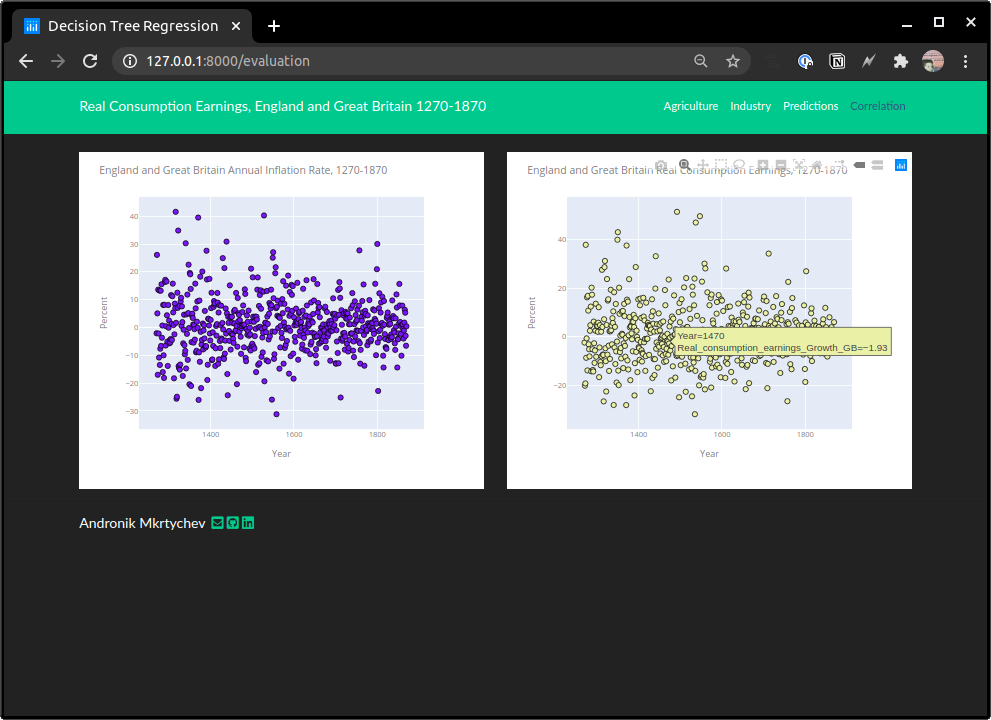
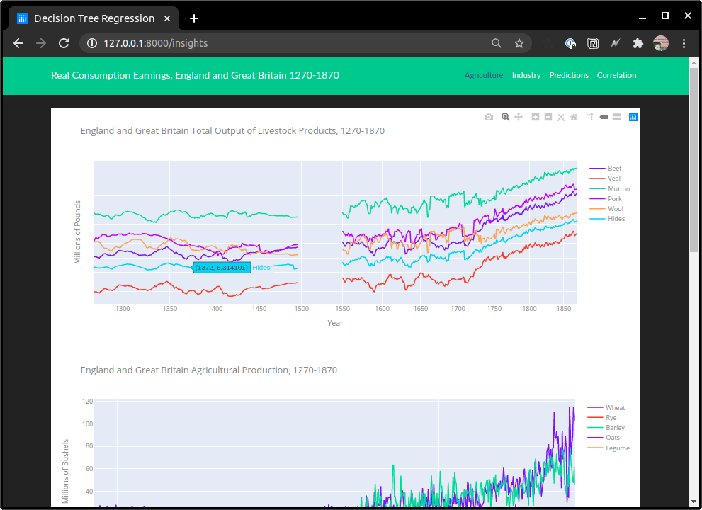

# U.K. Economic Data Dash App
[](https://github.com/plotly/dash/blob/master/LICENSE)

#### *Dash is a Python framework for building analytical web applications. No JavaScript required*.

Built on top of Plotly.js, React and Flask, Dash ties modern UI elements like dropdowns, sliders, and graphs directly to your analytical Python code. Read our tutorial proudly crafted ❤️ by Dash itself.

- [User Guide](https://dash.plotly.com/getting-started)

- [Offline (PDF) Documentation](https://github.com/plotly/dash-docs/blob/master/pdf-docs/Dash_User_Guide_and_Documentation.pdf)

- [Dash Docs on Heroku](https://dash-docs.herokuapp.com/) (for corporate network that cannot access plotly.com)

# Introduction
The economic development of Europe proceeded political consolidation and differentiation. As large sovereignties emerged and state regulation superseded guild and municipal regulation, economic development could extend freely over a wider territories. Between 1270 and 1870 England and Great Britain slowly progressed from the periphery of the European economy to centre-stage of an integrated global economy. In the process Britain escaped the Malthusian trap and by the eighteenth century had successfully reconciled a rising population with a rising standard of living.


## Installation

### From source

```bash
# make a local copy of directoy
git clone https://github.com/andronikmk/uk-data-dash-app.git

# cd into correct directoy
cd uk-data-dash-app

# create enviornment
pipenv install

# activate enviornment
pipenv shell

# deploy locally
gunicorn run:server
```
```console
[2020-07-22 16:34:33 -0400] [5442] [INFO] Starting gunicorn 20.0.4
[2020-07-22 16:34:33 -0400] [5442] [INFO] Listening at: http://127.0.0.1:8000 (5442)
[2020-07-22 16:34:33 -0400] [5442] [INFO] Using worker: sync
[2020-07-22 16:34:33 -0400] [5444] [INFO] Booting worker with pid: 5444
```

### Plotly Dash App










